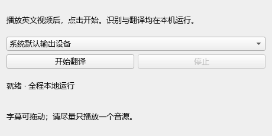

# Windows 全局实时字幕翻译器

把 Windows 正在播放的英文声音转换为悬浮中文字幕。第一版采用本地英文识别和离线英译中，不需要账号、API Key、订阅或付费翻译服务。

**不局限于 YouTube。** 工具从系统输出设备捕获声音，面向不同网页、在线课程和本地播放器；不依赖网站自带字幕，也不需要浏览器插件。受保护内容、特殊音频路径和独占全屏仍可能影响使用。

当前版本：**v0.1.0 / Windows CPU MVP**。

## 功能

- 一键开始、停止，选择实际播放声音的扬声器或耳机。
- WASAPI Loopback 捕获系统声音，默认不采集麦克风。
- faster-whisper 本地英文识别，OPUS-MT 本地翻译为简体中文。
- 可拖动、置顶的悬浮中文字幕。
- 优先在短停顿处分段，连续声音最长约六秒一段。
- 有界音频队列，处理过慢时跳过旧片段，避免延迟无限累积。
- 模型首次准备后，日常识别和翻译可完全离线运行。

## 界面



下面是字幕窗口的显示示例，示例文字用于展示布局，不代表术语识别准确率。


## 快速开始

### 准备环境

1. 使用 Windows 64 位电脑，安装 Python 3.12，并让 `python` 命令可以使用。
2. 下载本仓库 ZIP 并完整解压，或使用 Git 克隆。
3. 双击 `subtitle-translator/setup.cmd`，安装免费依赖并下载模型。首次准备需要网络和磁盘空间，模型文件合计约 292 MB，依赖还会占用额外空间。
4. 看到“准备完成”后，双击根目录的 **`启动字幕翻译器.cmd`**。

安装过程创建仓库目录内的 `.venv`，模型放在 `subtitle-translator/models`；不要求修改已有 Python 环境。安装依赖默认使用清华开源镜像，模型从 Hugging Face 下载并校验完整性。连接中断后可重新运行准备脚本续传。

### 开始翻译

1. 打开英文视频或音频。
2. 选择“系统默认输出设备”，或选择正在使用的扬声器、耳机。
3. 点击“开始翻译”，等待本地模型加载。
4. 在悬浮窗口查看中文字幕，可拖动调整位置。
5. 点击“停止”结束。切换耳机或输出设备后，停止并重新选择设备。

尽量只播放一个音源；同一输出设备上的多个应用声音可能混在一起。

## 运行方式与成本

```text
Windows 系统声音
  → 音频分段 / 静音判断 / VAD
  → faster-whisper 英文识别
  → CTranslate2 + OPUS-MT 英译中
  → PySide6 悬浮中文字幕
```

第一版使用 **CPU**，无需显卡或 CUDA。识别和翻译共享 CTranslate2 运行引擎，不必安装 PyTorch。GPU 加速尚未接入此版本。

本项目不调用收费 API，不依赖免费试用额度，也不需要服务器。运行仍会消耗现有电脑的资源、电力和首次下载流量。

## 隐私

识别和翻译在本机处理，运行应用启用离线模型模式；默认不上传音频或字幕、不采集遥测、不保存用户音频或字幕。首次安装依赖和下载模型需要联网。

## 已知限制

- 目前只针对英文语音翻译为简体中文，不支持自动识别所有外语。
- 技术缩写可能听错，译文可能生硬；例如测试中 VAE 曾被识别为“VD coder”。
- 连续无停顿语音、背景音乐、多人重叠说话可能增加延迟或降低准确率。
- 当前是分段处理，无法做到零延迟；六秒最长片段可能切断长句。
- 不隔离指定应用的声音，不绕过受保护音频。
- 受保护视频、独占全屏、多显示器和不同输出设备尚未全面验证。
- 暂无双语切换、字幕导出、笔记、自动 GPU 配置或独立 EXE 安装包。

## 验证情况

在 Windows 11、i5-13600KF、约 32 GB 内存的电脑上，以 CPU 模式完成：

- 三段实际系统声音回环到中文字幕的检查。
- 十条清晰合成英文语音的离线识别、翻译检查；人工判断九条主要意思可理解。
- 十五分钟合成音频管线持续运行，产生 299 条字幕，无错误。
- 音频重采样、静音过滤、队列上限、停顿分段和连续声音长度限制检查。

短样本的识别加翻译耗时约 0.36～0.41 秒，**不包括音频捕获、分段等待和模型首次加载，不等于完整字幕延迟**。不同网站的实际视频播放尚未完成验收，不据此承诺所有来源都兼容。详见[测试记录](docs/测试记录.md)。

## 开发与检查

完成首次准备后，可在仓库根目录运行：

```powershell
.\.venv\Scripts\python.exe subtitle-translator\test_core.py
```

生成本地英文样本并做模型检查：

```powershell
powershell -File subtitle-translator\make_test_audio.ps1
.\.venv\Scripts\python.exe subtitle-translator\check_integration.py
```

`check_live.py` 会播放三段测试语音，检查真实回环。`check_sustained.py` 对合成音频做十五分钟静音持续检查。生成的测试音频和结果留在本机，不属于仓库内容。

## 项目文件

- `subtitle-translator/app.py`：控制界面、系统音频捕获、后台处理和字幕窗口。
- `subtitle-translator/core.py`：分段、重采样、静音判断和队列处理。
- `subtitle-translator/translation.py`：本地英译中。
- `subtitle-translator/prepare_models.py`：模型下载、续传、校验和自检。
- `docs/需求文档.md`：MVP 的目标、边界与开发说明。

仓库不包含虚拟环境、模型权重、依赖安装包、用户音频或个人项目参考资料。

## 第三方项目

- [faster-whisper](https://github.com/SYSTRAN/faster-whisper)与 [base.en 模型](https://huggingface.co/Systran/faster-whisper-base.en)。
- [OPUS-MT 英译中](https://huggingface.co/Helsinki-NLP/opus-mt-en-zh)及其 [CTranslate2 转换版](https://huggingface.co/gaudi/opus-mt-en-zh-ctranslate2)。
- [CTranslate2](https://github.com/OpenNMT/CTranslate2)、[PyAudioWPatch](https://github.com/s0d3s/PyAudioWPatch)、[PySide6](https://doc.qt.io/qtforpython-6/)。

第三方组件和模型各自适用其许可，模型卡随首次下载保存在模型目录。当前仓库交付应用源码，不包含第三方二进制或模型权重；独立打包分发时需保留相应许可与通知。
